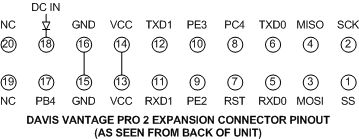

# davis-weather

## davis-esp

Software for ESP8266 or ESP32 for collecting data from Davis Vantage Pro2 weather station and
publishing to an AWS SNS topic.

TODO: queues, LOOP/LOOP2 read frequency + SQS publish frequency, SQS message format

### Wiring

- GND pin 16 to ESP ground
- RXD0 pin 5 to ESP TX
- TXD0 pin 6 to ESP RX

## davis-lib

Javascript library for working with data collected from the Davis weather station.

- extracting raw packet data from a message as published by davis-esp
- CRC validation
- parsing fields from a packet into a JSON object

## sqs-backup

AWS Service for backing up Davis weather station data to an S3 bucket.

Schedule period: 1 day

S3 object format:

- key: "{{epoch time}}"
- content: contiguous, each packet prefixed with 4 bytes for epoch timestamp + 2 bytes packet type
